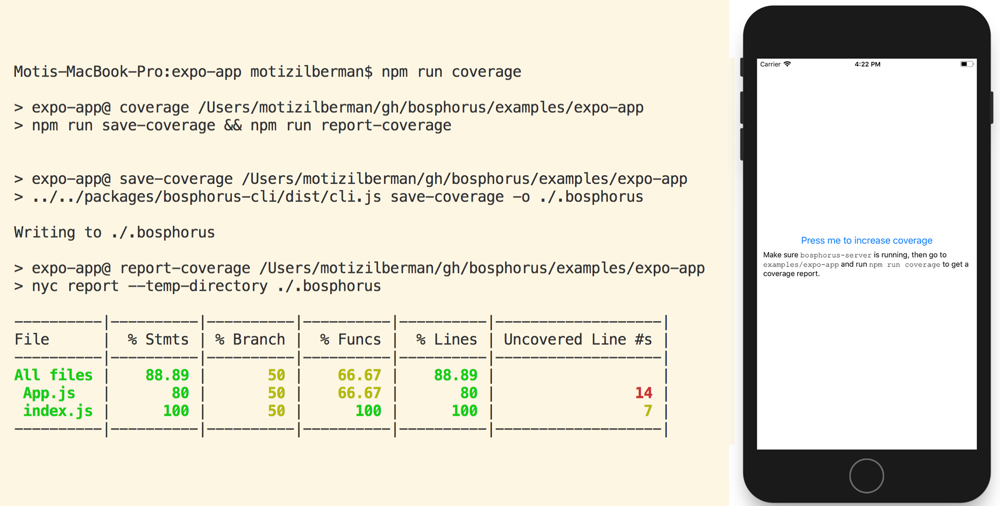
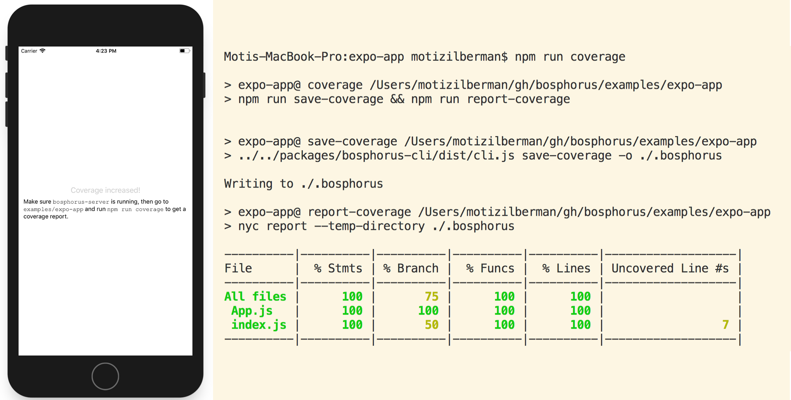

# bosphorus + Expo

A basic example of generating coverage reports on demand from a running React Native app, built with [Expo](https://expo.io/).

* The app is instrumented with [`babel-plugin-istanbul`](https://github.com/istanbuljs/babel-plugin-istanbul), which collects coverage data in a global variable within the app, called `__coverage__`. This is configured in [`.babelrc`](https://github.com/motiz88/bosphorus/blob/master/examples/expo-app/.babelrc).
* The app calls [`startCoverageClient()`](https://github.com/motiz88/bosphorus/blob/cabb24206d2c5e7316162b27a605cca0579ae0ff/examples/expo-app/src/index.js#L5) (from [`bosphorus-client`](https://github.com/motiz88/bosphorus/tree/master/packages/bosphorus-client)) on startup. By default, this expects to find [`bosphorus-server`](https://github.com/motiz88/bosphorus/tree/master/packages/bosphorus-server) running at `http://localhost:8123`.
* At any given time while the app is running, [`bosphorus-cli`](https://github.com/motiz88/bosphorus/tree/master/packages/bosphorus-cli) can request a JSON snapshot of the coverage data from the server, which can then be consumed by the standard IstanbulJS reporting tools. An example of doing both is provided as `npm run coverage` in this package.

Try running `npm run coverage` before and after pressing the button to see the coverage change:

### Before

### After

